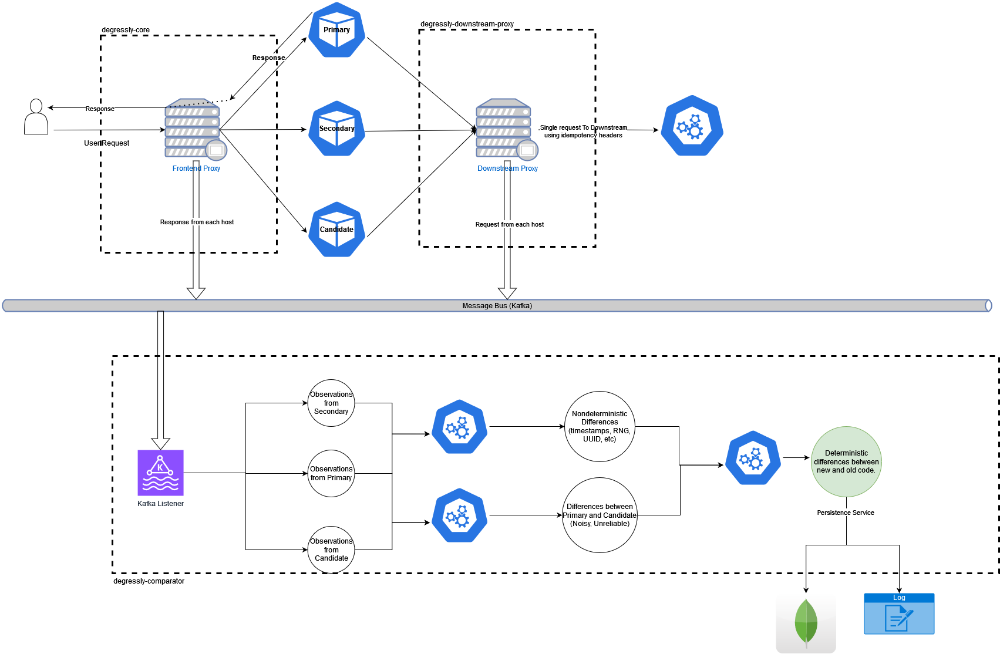

# Degressly

[](https://www.buymeacoffee.com/daniyaalk)

---

Degressly is a portmanteau of "Deterministic Regression". Inspired by [opendiffy/diffy](https://github.com/opendiffy/diffy), degressly aims to create a scalable framework for performing regression testing.

Degressly works by running three parallel instances of your code side by side and multicasting all inbound requests to all three instances. The primary and secondary instances run your last known good code, while the candidate instances runs code that is to be tested.
Differences between primary and candidate instances involve noise from non-deterministic sources like random number generation and timestamps, these differences are ignored based on the differences obtained from responses of primary and secondary instances.

The degressly ecosystem depends on the following repositories:

| Repository               | Description                                                                                                                                                                                                                                                      |
|--------------------------|------------------------------------------------------------------------------------------------------------------------------------------------------------------------------------------------------------------------------------------------------------------|
| [degressly-core](https://github.com/degressly/degressly-core)       | Core frontend HTTP Proxy. Logs responses from each downstream separately, can be configured to push observations for analysis by degressly-comparator.                                                                                                           |
| [degressly-comparator](https://github.com/degressly/degressly-comparator) | Analyzes observations received from Primary, Secondary and Candidate deployments                                                                                                                                                                                 |
| [degressly-downstream](https://github.com/degressly/degressly-downstream) | Downstream proxy for services that make S2S calls to downstream services, with the ability to accomodate non-idempotent downstreams. Logs requests from each downstream separately, can be configured to push observations for analysis by degressly-comparator. |




## Getting Started

Clone repository:
```bash
git clone https://github.com/degressly/degressly-core.git
cd degressly-core
```

### Running Docker singleton
```bash
docker build -f Dockerfile -t degressly-core:latest
docker run -p8000:8000 degressly-core:latest
```

### Running with docker-compose

Create .env file:
```bash
touch .env
nano .env
```

Sample `.env` file:
```
primary_host=http://host.docker.internal:9000
secondary_host=http://host.docker.internal:9001
candidate_host=http://host.docker.internal:9002
```
_Note on host names: https://docs.docker.com/desktop/networking/#i-want-to-connect-from-a-container-to-a-service-on-the-host_

```bash
docker build -f Dockerfile -t degressly-core:latest
docker compose up
```


### Running full degressly ecosystem with docker-compose:
Clone all repos and build docker images:
```bash
git clone https://github.com/degressly/degressly-core.git
git clone https://github.com/degressly/degressly-comparator.git
docker build degressly-core/ -t degressly-core:latest 
docker build degressly-comparator/ -t degressly-comparator:latest 
cd degressly-core
```

Create .env file:
```bash
touch .env
```
```
spring_profiles_active=mongo
diff_publisher_bootstrap-servers=kafka:9092
diff_publisher_topic-name=diff_stream
primary_host=http://host.docker.internal:9000
secondary_host=http://host.docker.internal:9001
candidate_host=http://host.docker.internal:9002
MONGO_URL=<mongo_cluster_url>/<mongo_db_name>
MONGO_USERNAME=<mongo_username>
MONGO_PASSWORD=<mongo_password>
MONGO_DBNAME=<mongo_db_name>
```
_Note on host names: https://docs.docker.com/desktop/networking/#i-want-to-connect-from-a-container-to-a-service-on-the-host_ 

Run containers
```bash
docker compose --profile full up
```

### Config flags

| VM Options (When running jar)    | Environment Variables (When using Docker) | Example                                                  | Description                                                                  |
|----------------------------------|-------------------------------------------|----------------------------------------------------------|------------------------------------------------------------------------------|
| diff.publisher.bootstrap-servers | diff_publisher_bootstrap-servers          | false(default)                             \| kafka:9092 | Address of kafka bootstrap servers for integration with degressly-comparator |
| diff.publisher.topic-name        | diff_publisher_topic-name                 | diff_stream                                              | Kafka topic name for integration with degressly-comparator                   |
| primary.host                     | primary_host                              | http://localhost:9000 / http://host.docker.internal:9000 | Forwarding address of primary instance                                       |
| secondary.host                   | secondary_host                            | http://localhost:9001 / http://host.docker.internal:9001 | Forwarding address of secondary instance                                     |
| candidate.host                   | candidate_host                            | http://localhost:9002 / http://host.docker.internal:9002 | Forwarding address of candidate instance                                     |
| return.response.from             | return_response_from                      | PRIMARY(default) \| SECONDARY \| CANDIDATE               | Which instance's response is to be returned to the user.                     |

## Limitations / TODO
_In no particular order:_
* DB layer observation recon (comparator can consume from debezium or similar CDC pipeline).
* DB Proxy...?
* Performance regression tracking.
* Dockerization.

## Support

If you would like to reach out for support or feature requests, feel free to drop an email at [me@daniyaalkhan.com](mailto:me@daniyaalkhan.com)

